# 3D Object Detection via Lidar Sensor
In this project, the data from top-mounted lidar sensor on the Waymo vehicles were used to perform 3D object detection using deep learning algorithms. The following steps were taken to complete this task:
## Compute Lidar Point-Cloud from Range Image
The lidar data is stored in form of range images in the [Waymo Open Data Set](https://waymo.com/open/terms). The following steps were taken:

- **Visualize range image channels (ID_S1_EX1):** This task involved writing code within the function `show_range_image` located in the file `student/objdet_pcl.py`. The range image "range" and "intensity" channels were mapped onto 8-bit scale grayscale range and intensity images, respectively. Note, the intensity channel was normalized with the difference between the 1- and 99-percentile to mitigate the influence of outliers (e.g, high intensity from highly reflective objects). Both range and intensity images were then crropped to focus on +/- 90 degrees left and right of the forward-facing x-axis. The range and intensity images were then vertically stacked and visualized using [OpenCV](https://opencv.org/) as follows:

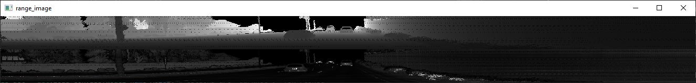

- **Visualize point-cloud (ID_S1_EX2):** This task involved writing code within the function `show_pcl` located in the file `student/objdet_pcl.py`. The range image visualized in the previous task was then converted to a 3D point cloud using the laser sensor calibration and visualized in the vehicle coordinate system using [Open3D](http://www.open3d.org/). An example is shown below and further discussion on the point clouds can be found later in [this section](#Examples-of-vehicles-with-varying-degrees-of-visibility-in-the-point-cloud)

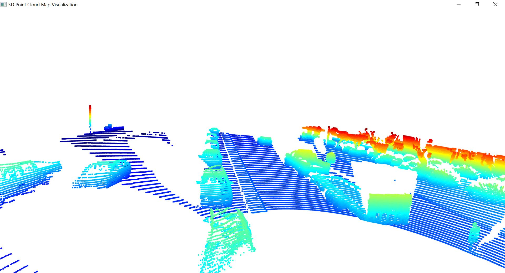

## Create Birds-Eye View from Lidar PCL
This task involved writing code within the function `bev_from_pcl` located in the file `student/objdet_pcl.py`. The point cloud obtained from the range image was then converted to Birds-Eye-View (BEV) RGB image which later was used for 3D object detection. The following steps were taken:

- **Convert sensor coordinates to bev-map coordinates (ID_S2_EX1):** The point cloud coordinates (x,y) [m] were converted to new cooordinates in the bev coordinate system (x,y) [pixel] based on width and height of the bev map. 

- **Compute intensity layer of bev-map (ID_S2_EX2):** Lidar intensity values were assigned to the cells of the bird-eye view map as follows:

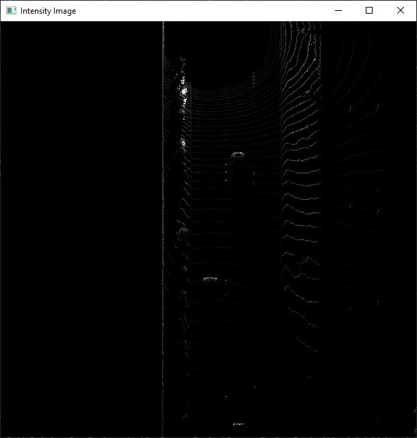

- **Compute height layer of bev-map (ID_S2_EX3):** Lidar point cloud height values were assigned to the cells of the bird-eye view map as follows:

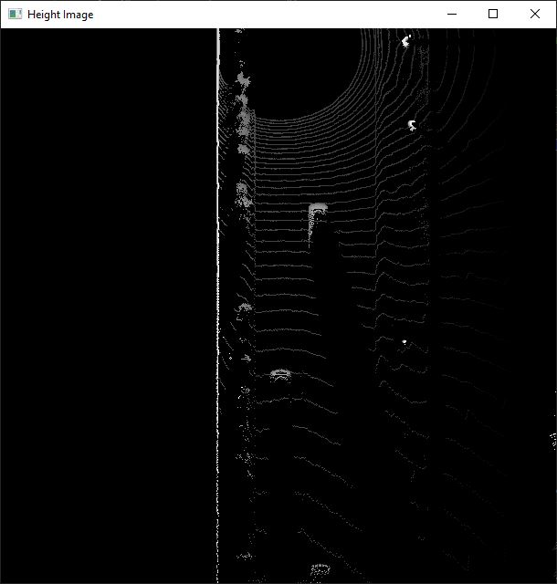

- **Compute density layer of the BEV map:** The density layer of the BEV map was calculated based on the number of points within each BEV cell.

The three layers of the BEV map including intensity layer, height layer, and density layer were then stacked to form an RGB image. An example is shown below:

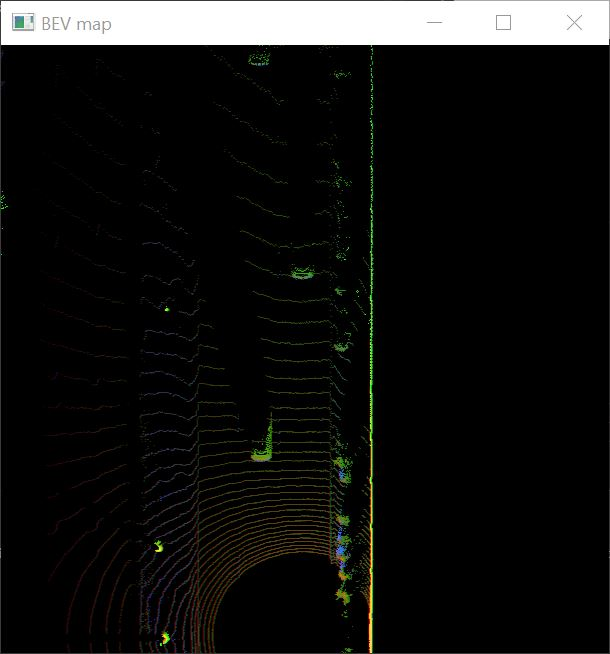

## Model-based Object Detection in BEV Image
This task involved writing code within the functions `load_configs_model`, `create_model`, and  `detect_objects` located in the file `student/objdet_detect.py`. 

- **Add second model from a GitHub repo (ID_S3_EX1):** A second model architecture, in addition to [Complex YOLO](https://paperswithcode.com/paper/complex-yolo-real-time-3d-object-detection-on), were extracted for output decoding and post-processing called [Super Fast and Accurate 3D Object Detection based on 3D LiDAR Point Clouds](https://github.com/maudzung/SFA3D). The architecture is the ResNet-based Keypoint Feature Pyramid Network (KFPN) that was proposed in [RTM3D paper](https://arxiv.org/pdf/2001.03343.pdf). 
    * The configuration (`configs` structure) of the pretrained model was set in `load_configs_model` function defined in `student/objdet_detect.py`.
    * The model for `fpn_resnet` in `create_model` function defined in `objdet_detect.py` was instantiate .
    * After model inference has been performed, the output was decoded using `decode` function and perform post-processing using `post_processing` function in `detect_objects` function defined in `student/objdet_detect.py`.

- **Extract 3D bounding boxes from model response (ID_S3_EX2):** As the model input is a three-channel BEV map, the detected objects will be returned with coordinates and properties in the BEV coordinate space. Thus, before the detections can move along in the processing pipeline, they need to be converted into metric coordinates in vehicle space.This conversion was performed such that all detections have the format `[1, x, y, z, h, w, l, yaw]`, where 1 denotes the class id for the object type `vehicle`. The task was completed in `detect_objects` function defined in `student/objdet_detect.py`The results was visualized as follows:

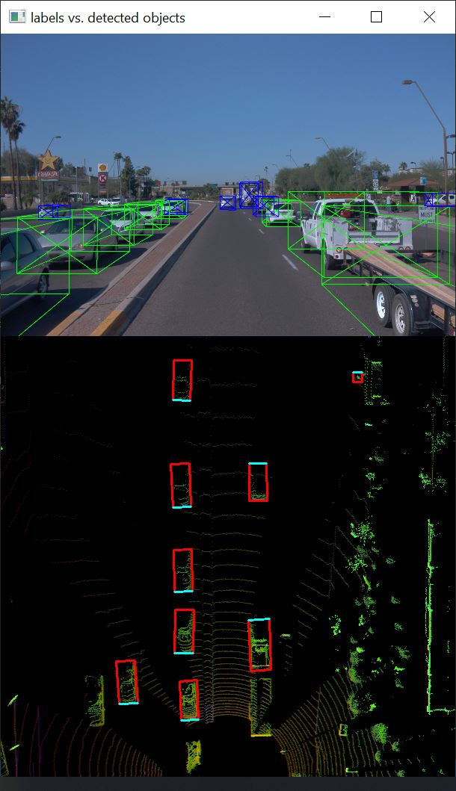

## Performance Evaluation for Object Detection
- **Compute intersection-over-union between labels and detections (ID_S4_EX1):** This task involved writing code within `measure_detection_performance` function located in the file `student/objdet_eval.py`. The goal of this task was to find pairings between ground-truth labels and detections, so that we can determine wether an object has been (a) missed (false negative), (b) successfully detected (true positive) or (c) has been falsely reported (false positive). Based on the labels within the [Waymo Open Data Set](https://waymo.com/open/terms), the task was to compute the geometrical overlap between the bounding boxes of labels and detected objects and determine the percentage of this overlap in relation to the area of the bounding boxes which is called intersection over union (IoU).

    * The function `tools.compute_box_corners` was used to return the four corners of a bounding box which were used with the [Polygon](https://shapely.readthedocs.io/en/stable/manual.html#polygons) structure of the [Shapely](https://shapely.readthedocs.io/en/stable/manual.html) toolbox. 
    * Each detected object was assigned to a label only if the IoU exceeds a given threshold.
    * In case of multiple matches, the object/label pair with max. IoU was kept.
    * All object/label-pairs were counted and stored as `true-positives`.

- **Compute false-negatives and false-positives (ID_S4_EX2):** Subsequently, the number of `false-negatives` and `false-positives` based on the results from IoU and the number of ground-truth labels were computed

- **Compute precision and recall (ID_S4_EX3):** `precision` was computed over all evaluated frames using `true-positives` and `false-positives`, and `recall` was computed over all evaluated frames using `true-positives` and `false-negatives`.

## Examples of vehicles with varying degrees of visibility in the point-cloud
### Rear view of vehicles
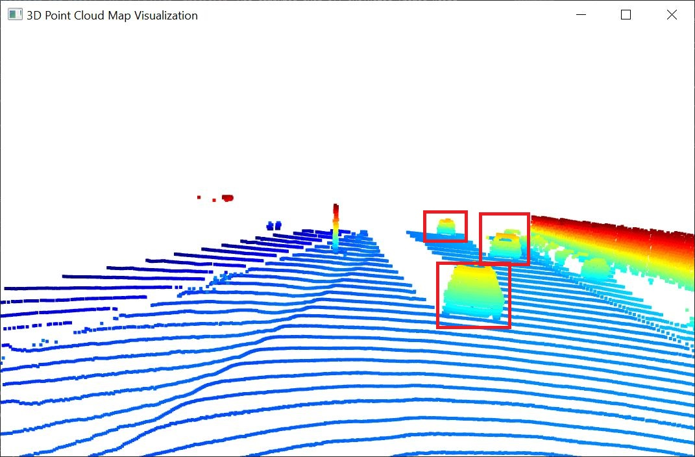

### Front view of vehicls
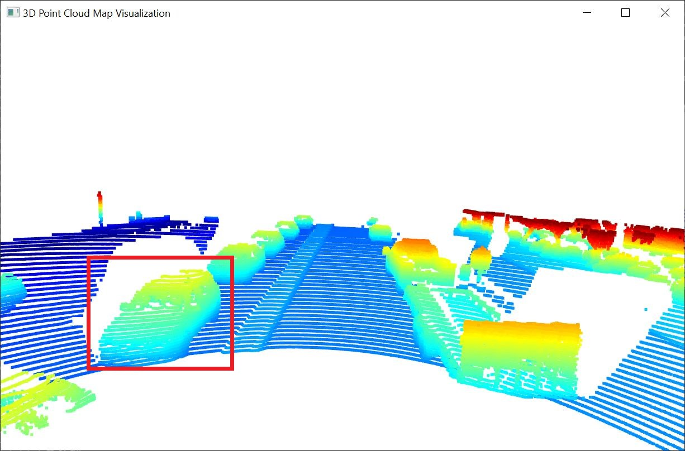

### Side view of vehicles
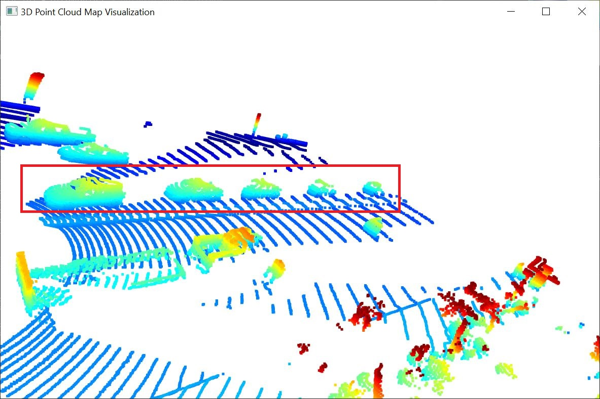

### Nearby vehicle
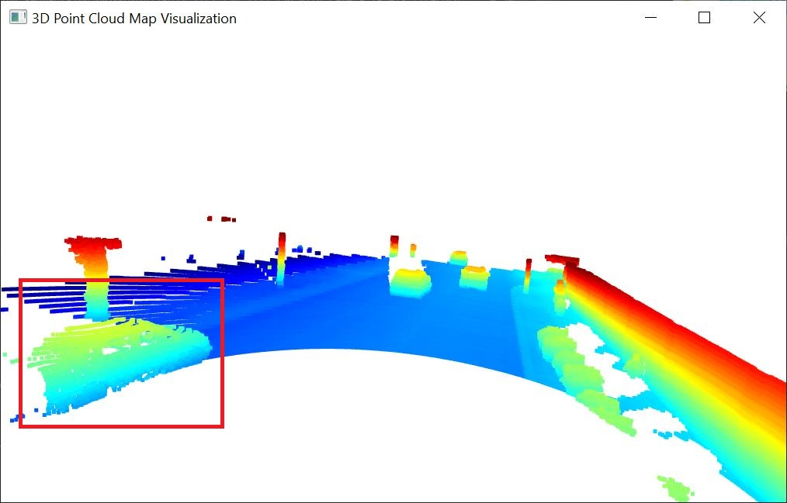

## Occluded Vehicle
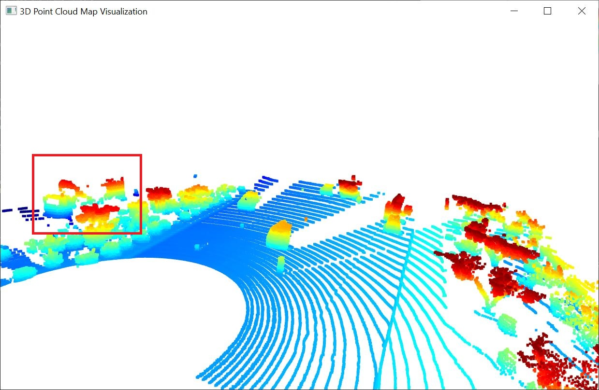

## Features on range image

## Vehicle features that appear as a stable feature on most vehicles

- **Tail-lights:** Due to highly reflective nature of these surfaces, they reflect the lidar laser beams with high intensity.

- **License plate:** Due to highly reflective surface, license plates reflect the lidar laser beams with high intensity. In addition, as an stable feature, they are oftentimes located at the center of the front and rear bumpers
- **Wheels:** They have round shape located at the bottom of the side view of the vehicles. In addition, the aluminum alloy wheels and steel wheels are also highly reflective.

- **Front and rear-bumpers:** They generate dense reflection on lidar point clouds.

- **Mirrors:** They appear at the sides of vehicles.

- **Windshields:** They are made of glass and since the laser beams go through them, they appear as holes in the point cloud since they do not reflect the laser beams with high intensity compared to other objects.

- **Shape of the vehicle:** The vehicles are easily distinguishable using the front view, rear view and side view. 

