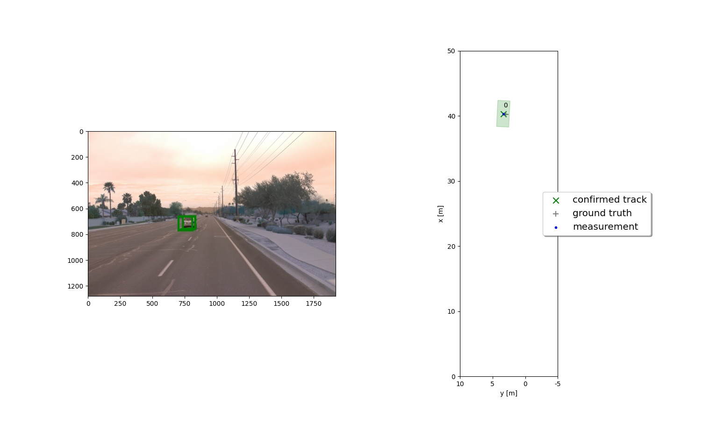
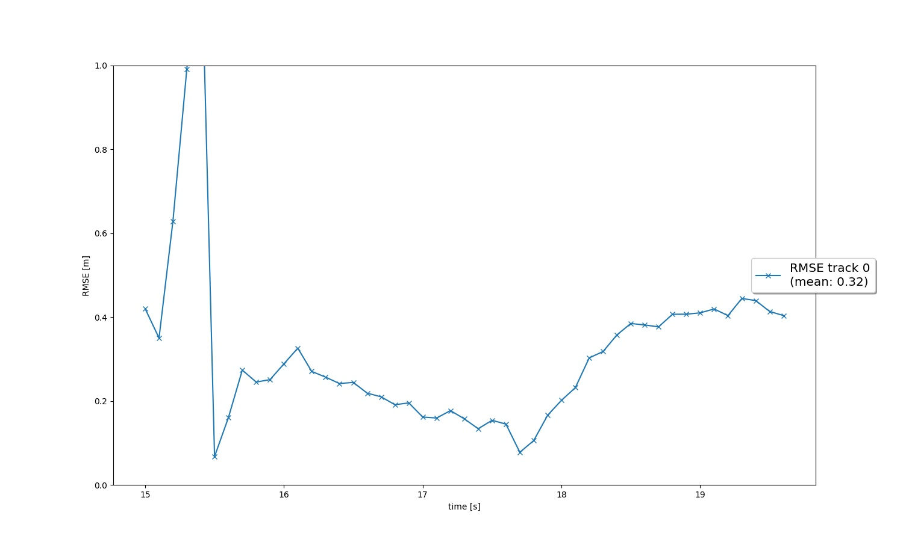
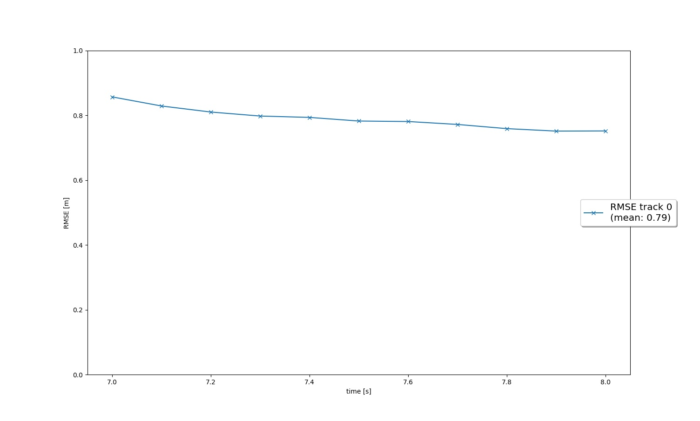
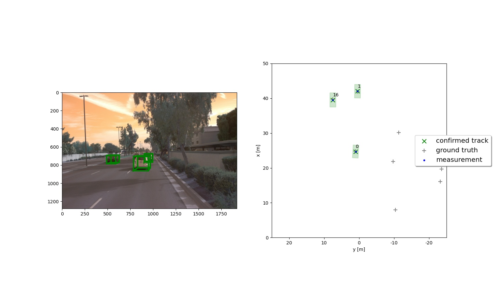
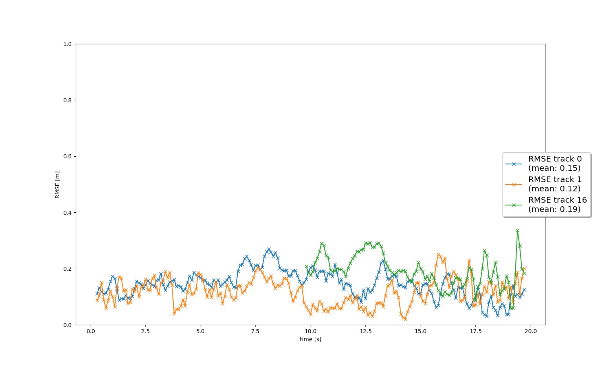
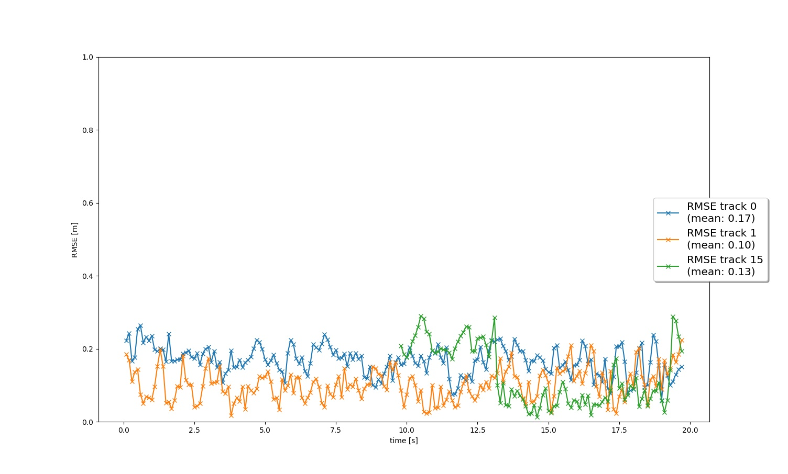
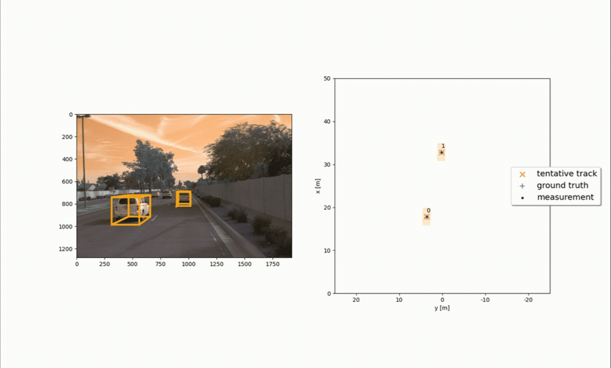
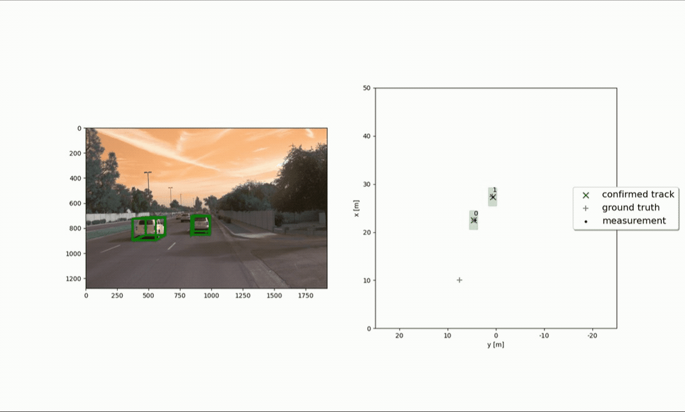

# Track 3D-Objects Over Time

This project demonstrates how sensor fusion algorithm along with approperaite track management algorithm enables tracking multiple targets/objects over time via fusing measurments of Lidar and Camera sensors. In order to achieve this goal, four steps were developed:
- Extended Kalman Filter (EKF)
- Track management
- Association
- Lidar and camera fusion

In the following each step is explained.

## Step 1: Extended Kalman Filter (EKF) design
To implement an Extented Kalman Filter (EKF), a class called `Filter` was implemented in `student/filter.py` that contained the following instance methods (functions):
- **System transition funtion:** this function returns, in this case, a 6-by-6 matrix `F` which defines the dynamic model of the system.
- **Process noise covariance matrix:** this function returns a 6-by-6 process noise covariance matrix `Q` defined baased on the sampling time `dt` and a tunnable parameter `q`.
- **Prediction:** this function returns the prediction of the dynamic model as `a priori estimate` of the state `x` and error covariance matrix `P` using `F`, `Q`, and the estimate from previous iteration.
- **Residual:** this function returns the residual `gamma` as the difference between the actual measurement and estimated output using `a priori estimate` from prediction step and measurement function `h`. 
- **Residual Covariance:** this function returns the covariance of the residual `S` using the Jacobian of the measurment function `H`, a priori estimate of error covariance matrix `P`, and measurement noise covariance matrix `R`.
- **Update:** this function returns a posteriori estimate of state vector `x` and error covariance `P` by updating a priori estimate using Kalman gain `K`, residual `gamma`, Jacobian of the measurment function `H`, and residual covariance matrix `S`.

The implemented EKF was applied to a simple single-target scenario with lidar data as the only measurement. The results are shown below with mean root-mean-square-error (RMSE) of 0.32:

## Step 2: Track management
Two classes were implemented in `student/trackmanagement.py`:

### **Track:** 
This class is used to either initialize a new track based on new measurement or update a previously initialized track. Track initialization from unassigned measurements is implemented. 

- First, the state vecotr `x` is initialized using the 3D position of the detected object with 3D velocity of zero. The initialized state vector is then homogeneously transformed from the sensor frame to the vehicle frame using transformation matrix composed of a rotation matrix and a translation vector. 

- Second, The error covariance matrix `P` is initialized. It is composed of two parts: (1) error covariance matrix related to the position states which is obtained via transforming the measurement noise covariance matrix `R` to the vehicle fram using the rotation matrix; and (2) error covariance matrix related to the velocity state which is defined as a diagonal matrix with diagonal element are tunnable parameters. 

- Thirs, other track attributes such as track `id`, object `width`, object `length`, object `height`, object `yaw` angle, and measurement time `t` are also defined. 

- Fourth, there are instance methods (functions) defined for updating track attributes called `set_x`, `set_P`, `set_t`, `update_attributes`. 

### **Trackmanagement:** 
This class is defined to nitialize, update and delete tracks. The following class methods (functions) were defined:

- **manage_tracks:** this function decreases the track score for unassigned tracks; delete tracks using `delete_track` if the score is smaller than a threshold (0.6 for `confirmed` tracks and 0.17 for `tentative` tracks) or if the error covariance matrix `P` is too big (sigma equals to 3 meters); and initialize new track with unassigned measurement using `init_track`.

- **addTrackToList:** adds a track to an attribute called `track_list`.

- **init_track:** initializes a new track from an unassigned measurement.

- **delete_track:** deletes a track.

- **handle_updated_track:** this function increases track score for updated tracks and sets track state to `tentative` or `confirmed`.

The figure below shows the RMSE plot for a single track. Note that the RMSE is quite high in this scenario (around 0.8), however, we compensate this through sensor fusion once we include other sensors.

## Step 3: Association
A class called `Association` is defined in `student/association.py`. This class associate measurements to tracks with nearest neighbor association. The class is initiated with empty `association_matrix`, `unassigned_tracks`, `unassigned_meas` representing association matrix, unassigned tracks, and unassigned measurements, respectively. The following methods were implemented within the class:

- **associate:** this function replaces the `association_matrix` with the actual association matrix based on Mahalanobis distance (see `MHD` function) for all tracks and all measurements It updates the list of `unassigned_meas` and `unassigned_tracks`. 

- **get_closest_track_and_meas:** this function finds the closest track and measurement:
    - finds minimum entry in `association_matrix`
    - deletes the associated row and column
    - removes corresponding track and measurement from `unassigned_tracks` and `unassigned_meas`
    - return updated track and measurement
- **gating:** this function returns `True` if measurement lies inside the sensor gate if the Mahalonobis distance is smaller than a limit defined by chi-square distribution with reliability of 0.995 and degree-of-freedom of 6 (dimension of the sensor measurement) otherwise `False`.
- **MHD:** this function calculates and returns Mahalanobis distance between a track and a measurement.
- **associate_and_update:** this function performs the following tasks:
    - associates measurements and tracks
    - updates associated tracks with measurements 
    - searches for the next association between a track and a measurement 
    - checks visibility and only updates tracks that are in the field-of-view (`fov`) of the sensor 
    - performs Kalman update to update tracks
    - updates track score and track state 
    - saves updated track 
    - runs track management

Some results are shown below:

## Step 4: Lidar and camera fusion
Two classes of `sensor` and `Measurement` were defined. 

### **Sensor:**

Based on the type of the sensor, this class initiates sensor charactristics as attributes of the class:
- **Lidar:** the class initiates measurement dimension as `dim_meas`, a transformation matrix from sensor frame to vehicle frame as `sens_to_veh`, and sensor field-of-view as `fov`.
- **Camera:** the class initiates measurement dimension as `dim_meas`, a transformation matrix from sensor frame to vehicle frame as `sens_to_veh`, and sensor field-of-view as `fov`, focal length i-coordinate as `f_i`, focal length j-coordinate as `f_j`, principal point i-coordinate as `c_i`, principal point j-coordinate as `c_j`, and transformation fro vehicle frame to sensor frame as `veh`

- **in_fov:** this instance method (function) checks if an object can be seen by this sensor meaning if it is within the field-of-view of the sensor.

- **get_hx:** this function calculates the nonlinear measurement expectation value `h(x)` based on the type of the sensor (`Lidar` or `Camera`).

- **get_H:** this function calculates Jacobian `H` at current state `x` from `h(x)`.
- **generate_measurement:** this function generates a new measurement from this sensor and add to measurement list.

### Measurement: 
Measurement class includes measurement values `z`, measurement covariance matrix `R`, timestamp `t`, and an object from `sensor` class based on the type of the sensor used for measurement (`Lidar` or `Camera`).

## Results of Multi-Target-Tracking (MTT)

### **RMSE figure**

### **MTT Video Part 1**

### **MTT Video Part 2**

### Benefits in camera-lidar fusion compared to lidar-only tracking
- Sensor fusion is an essential part of self-driving cars because it improves single-sensor-results and compensates for sensor failures or weaknesses.
- Every sensor has advantages and disadvantages and may fail from time to time. For example:
    - the camera could be blinded by the sun
    - the view could be disturbed by rain drops
    - the camera image is a 2D projection of the 3D world, so measuring the accurate distance of other vehicles is not possible

- To solve these challenges, sensor fusion is needed. Different sensors have different physical measurement principles and can improve the reliability of the environment perception system.

- For example, in our current experiment, the ghost tracks can be eliminated faster when sensor fusion is applied. In addition, the RMSE for the tracks generally decreased when both lidar and camera were used compared to when lidar was used.

### Challenges a sensor fusion system faces in real-life scenarios

Depending on the sensors being used for measuring information from the environment different challenges could emerge:
- **Sampling frequeny:** if the sampling frequencies of the sensors differ significantly, the effect of fusion for reducing uncertainty would decrease.
- **Spatial resolution:** sensors could have different spatial resolution which could directly affect the perception process and sensor fusion. For example, camera provides 2D information of the environment while lidar provides 3D information of the surronding.
- **Coordinate alignment:** transformation from sensor to vehicle frame and vice versa could introduce error since the accuracy of such transformations could be affected by the calibration procedure.
- **System dynamic model:** having a simple linear time-invariant constant-velocity model for the state transition function can introduce some level of error into our sensor fusion algorithm.
- **Association model:** we used the Simple Nearest Neighbor (SNN) data association algorithm which enforces hard decisions in ambiguous situations. 

### How to improve tracking results 
- More advance nonlinear transition functions could better model the behavior of the objects
- Interacting Multiple Model (IMM) Kalman filter could be beneificial by taking advantage of multiple dynamic model for predicting the behavior of the detected objects.
- More advanced Probabilistic Data Association (PDA) techniques can avoid these hard decisions and resulting errors.
- Fine-tuning the hyperparameters and thresholds
- Adding additional sensors such as Radar.

